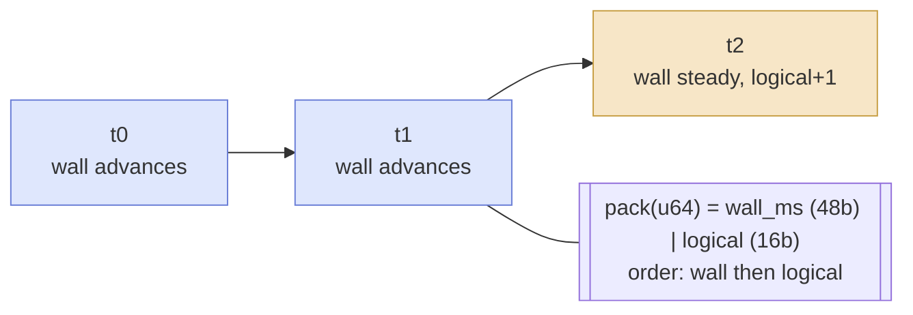
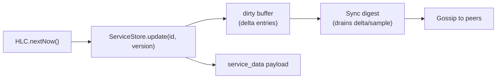
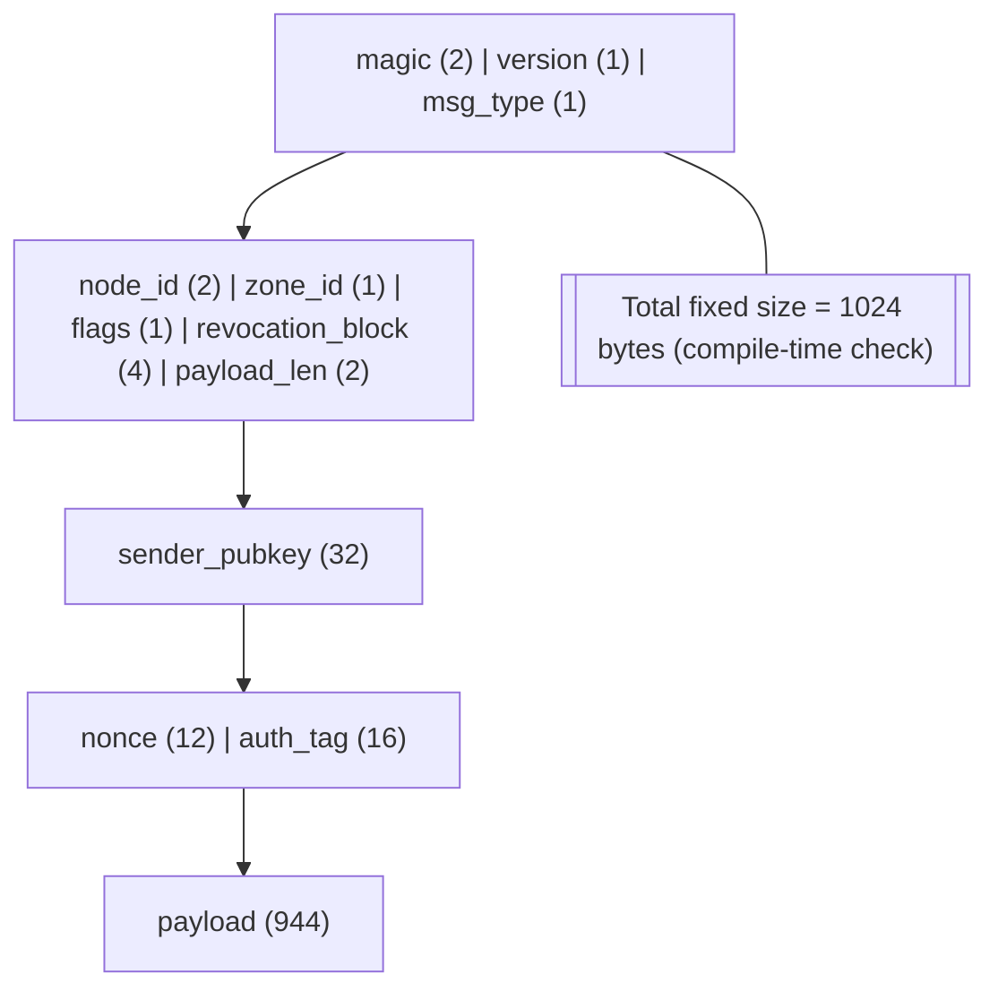
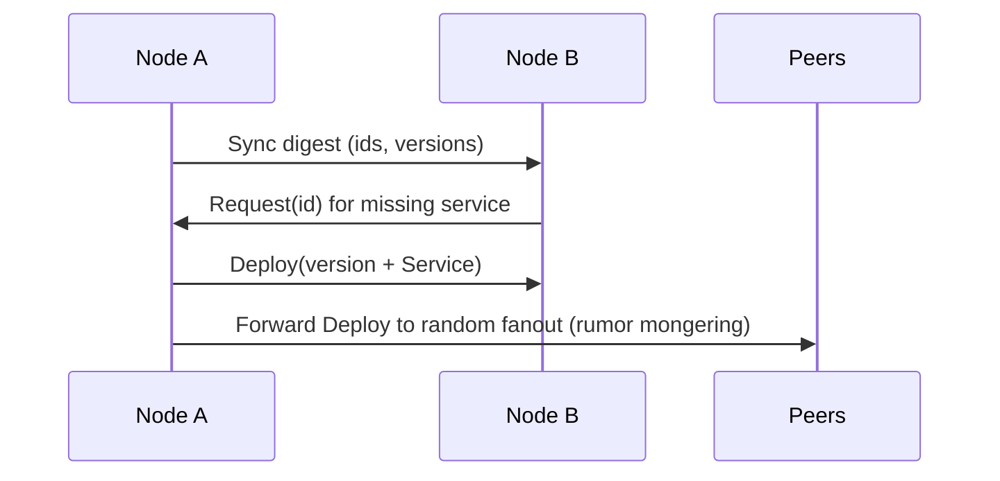

# Architecture (CRDTs and Packet Layer)

This document dives into how Myco tracks and gossips state. The focus is on the CRDT implementation (Hybrid Logical Clock-based last-write-wins) and the 1024-byte packet format that carries gossip, requests, and deployments.

## Runtime Shape
- A node (`src/node.zig`) bundles deterministic identity (`src/net/handshake.zig`), a WAL-backed knowledge counter (`src/db/wal.zig`), the service CRDT store, and a gossip loop driven by `tick`.
- Services are fixed-layout structs (`src/schema/service.zig`) that must fit inside a packet payload; they are stored alongside per-service HLC versions.
- Networking is packet-oriented for the simulator (`src/sim/net.zig`) and can be wrapped in transport security (`src/crypto/packet_crypto.zig`). Higher-level TCP framing for the real API lives in `src/net/protocol.zig`.

## CRDT Implementation

### Data Model and Timestamping
- CRDT key: service `id: u64`. Value: `version: u64` containing a packed Hybrid Logical Clock.
- HLC packing (`src/sync/hlc.zig`):
  - 48-bit wall clock milliseconds (`wall`).
  - 16-bit logical counter (`logical`).
  - `Hlc.pack` → `u64`; `Hlc.unpack` reverses. Ordering is `wall` first, then `logical`.
  - `next(now_ms)` generates local timestamps; `observe(remote, now_ms)` merges remote clocks and bumps logical counters to preserve monotonicity.

### State Storage
- `ServiceStore` (`src/sync/crdt.zig`) holds a map `id -> version` plus a `dirty` buffer of recent `Entry { id, version }` updates.
- `update(id, version)` is LWW: insert if missing or replace only if `Hlc.newer(incoming, current)` is true. It also appends to `dirty` so the change can be gossiped.
- `drainDirty(out)` copies and clears the oldest `dirty` entries into a caller buffer (used for delta digests).
- `populateDigest(buffer, rand)` reservoir-samples existing versions when no deltas are pending, giving periodic whole-state hints without allocating.

### Local Writes
- `Node.injectService`:
  - Calls `nextVersion()` (`Hlc.nextNow`) to mint a monotonic version.
  - `ServiceStore.update` persists the version; `service_data` stores the service payload.
  - Sets `dirty_sync` so the gossip loop emits a delta digest.

### Receiving and Conflict Resolution
- Deploy (`Headers.Deploy`):
  - Payload: 8-byte version (little-endian) + `Service` struct.
  - Node observes the remote version (`observeVersion`) to keep its HLC ahead of remote clocks.
  - Applies only if `incoming` is newer than local (`Hlc.newer`). Successful applies trigger `on_deploy` and re-gossip (hot potato fanout).
- Sync/Control digest (`Headers.Sync` / `Headers.Control`):
  - Payload is a compressed digest of `(id, version)` pairs. Newer entries (by HLC) are treated as misses.
  - Miss handling: immediately send a `Headers.Request` back to the advertising peer and enqueue the id in `missing_list` (capacity 1024, random replacement on overflow).

### Digest Encoding
- `Entry` digest items are LEB128-varint encoded via `encodeDigest` in `src/node.zig`:
  - The first two bytes store the count.
  - Each `(id, version)` is varint-encoded to maximize packing into the payload (fits far more than fixed-width encoding).
  - `decodeDigest` reverses the process with bounds checks.
- Delta digests use `ServiceStore.drainDirty`. Every 50 ticks, `populateDigest` samples existing state to help cold-start nodes even when no new writes occur. A lightweight Control message also piggybacks deltas every 10 ticks.

### Pull/Push Loop
- `tick` phases:
  1) Drain up to 64 queued misses, sending targeted `Headers.Request` packets (payload: the missing `id` encoded with `Packet.setPayload`).
  2) Process inbound packets (Deploy, Request, Sync/Control).
  3) Emit gossip:
     - `Headers.Sync` with delta digest if `dirty_sync` is set.
     - Periodic sample digest if idle.
     - `Headers.Control` every 10 ticks carrying a delta digest when available.
- Rumor-mongering: freshly applied Deploys are forwarded to random peers (fanout configurable via `MYCO_GOSSIP_FANOUT`, default 4) to speed convergence.

### Durability
- Knowledge height (a monotonic counter) is stored in a write-ahead log (`src/db/wal.zig`) with CRC32 per entry. On init, nodes replay the WAL to restore the last valid value and continue appending. Service CRDT state itself is in-memory; the WAL models durability for critical counters in simulations.

## Packet Format

### Layout (`src/packet.zig`)
- `Packet` is an `extern struct` forced to exactly 1024 bytes at compile time:
  - `magic: u16` (0x4d59, “MY”).
  - `version: u8`.
  - `msg_type: u8` (`Headers.Deploy`, `Sync`, `Request`, `Control`).
  - `node_id: u16`, `zone_id: u8`, `flags: u8`, `revocation_block: u32` (reserved/control fields).
  - `payload_len: u16` (bytes of valid payload).
  - `sender_pubkey: [32]u8` (Ed25519 public key of the sender).
  - `nonce: [12]u8` and `auth_tag: [16]u8` (used when packet crypto is enabled).
  - `payload: [944]u8 align(8)` (gossip digests, service payloads, or request ids).
- Helpers:
  - `setPayload(u64)` / `getPayload()` read/write an 8-byte little-endian value (used for Request ids).
  - `MycoOp` is a compact op header (`op_kind`, `obj_kind`, `obj_id`, `version`, `value_len`) for batching multiple ops inside the payload when needed.

### Semantics by Message Type
- Deploy: payload is `version (u64)` + `Service` struct; applied if HLC is newer.
- Request: payload is the missing `service id` (u64); receivers respond with a Deploy packet.
- Sync: carries a digest (varint-packed `(id, version)` pairs) of recently changed entries.
- Control: health/keepalive with an optional digest piggyback; used more frequently than Sync to bound staleness.

### Packet Cryptography (`src/crypto/packet_crypto.zig`)
- Algorithm: ChaCha20-Poly1305 AEAD over the payload; authentication binds selected header bytes (`magic`, `version`, `msg_type`, `node_id`, `zone_id`, `flags`, `revocation_block`, `payload_len`, `sender_pubkey`) via associated data (46 bytes).
- Key derivation:
  - Secrets come from environment: `MYCO_PACKET_KEY` (current) and optional `MYCO_PACKET_KEY_PREV` for rotation, with epochs `MYCO_PACKET_EPOCH`/`MYCO_PACKET_EPOCH_PREV`.
  - Keys are Blake3-hashed and mixed with an optional PSK (`MYCO_GOSSIP_PSK`), sender pubkey, destination id, and epoch.
  - The first four bytes of the nonce carry the epoch, enabling accept-from-previous-key rotation.
- Enforcement:
  - Encryption/verification is toggled per-transport (e.g., `NetworkSimulator` uses it when `crypto_enabled` is set).
  - Failed decrypt/MAC checks drop the packet before delivery.

### Transport Notes
- Simulator (`src/sim/net.zig`): models latency/jitter/loss, enqueues `Packet` structs, and optionally seals/opens payloads with the crypto layer. Metrics (sent/delivered per type) are tracked for tests.
- TCP protocol (`src/net/protocol.zig`): used for the control/API surface; it frames JSON envelopes and performs an Ed25519-based handshake with optional AES-GCM. This sits above the packetized gossip path.

## End-to-End Flow (Example)
1) A new service is deployed locally via the API: `injectService` mints `version = HLC.nextNow`, stores it, and marks the entry dirty.
2) The next `tick` sends a `Headers.Sync` with a delta digest describing the new `(id, version)`.
3) Peers receive the digest, detect the missing id, immediately send `Headers.Request` back to the advertising peer, and queue the id for retry.
4) The advertising peer replies with `Headers.Deploy` carrying the version and `Service`. Recipients accept if `Hlc.newer` holds, apply the service, and optionally forward the Deploy to a few peers (fanout).
5) Periodic Control messages and sample digests ensure newly booted nodes and nodes that missed earlier packets still converge without full-state transfers.

